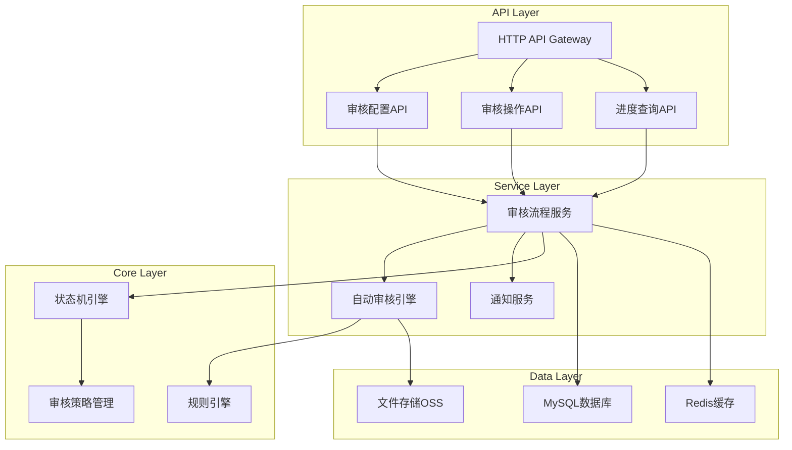
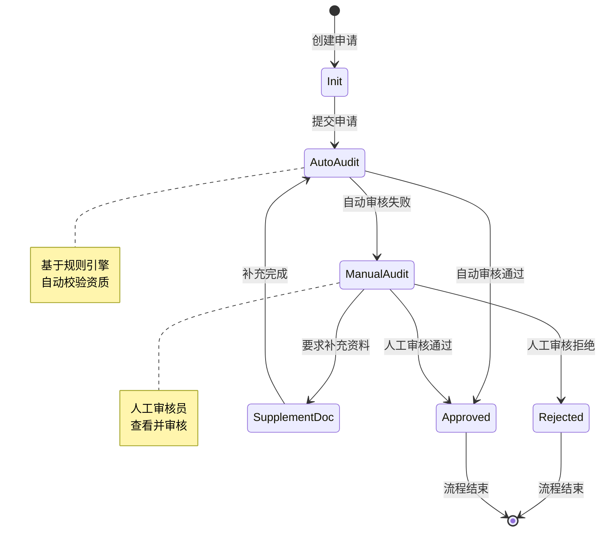

# 审核流程管理系统设计文档

## 概述

审核流程管理系统是天极票务系统的核心组件，负责管理商家入驻申请的审核流程。系统采用状态机模式设计，支持自定义审核流程配置、自动审核与人工审核的智能流转，并提供完整的审核进度追踪和历史记录功能。

## 架构设计

### 整体架构



### 微服务架构

系统基于现有的 Kitex (RPC) + Hertz (HTTP) 微服务架构：

- **RPC服务**: 处理核心业务逻辑和数据操作
- **API服务**: 提供HTTP接口和请求路由
- **状态机引擎**: 管理审核流程状态转换
- **规则引擎**: 执行自动审核规则

## 组件和接口

### 1. 审核流程配置组件 (AuditConfigService)

负责管理审核流程的配置和权限分配。

**接口定义:**
```go
type AuditConfigService interface {
    // 创建审核流程配置
    CreateAuditConfig(ctx context.Context, req *CreateAuditConfigReq) (*BaseResp, error)
    
    // 更新审核流程配置
    UpdateAuditConfig(ctx context.Context, req *UpdateAuditConfigReq) (*BaseResp, error)
    
    // 获取审核流程配置
    GetAuditConfig(ctx context.Context, req *GetAuditConfigReq) (*AuditConfigResp, error)
    
    // 配置审核权限
    ConfigAuditPermission(ctx context.Context, req *ConfigPermissionReq) (*BaseResp, error)
}
```

### 2. 自动审核引擎 (AutoAuditEngine)

基于规则引擎实现资质文件的自动校验。

**接口定义:**
```go
type AutoAuditEngine interface {
    // 触发自动审核
    TriggerAutoAudit(ctx context.Context, req *AutoAuditReq) (*AutoAuditResp, error)
    
    // 校验资质合规性
    ValidateQualification(ctx context.Context, req *ValidateQualificationReq) (*ValidationResp, error)
    
    // 获取审核规则
    GetAuditRules(ctx context.Context, req *GetRulesReq) (*AuditRulesResp, error)
}
```

### 3. 人工审核组件 (ManualAuditService)

处理人工审核操作和审核结果提交。

**接口定义:**
```go
type ManualAuditService interface {
    // 提交审核结果
    SubmitAuditResult(ctx context.Context, req *SubmitAuditReq) (*BaseResp, error)
    
    // 获取待审核列表
    GetPendingAudits(ctx context.Context, req *GetPendingReq) (*PendingAuditsResp, error)
    
    // 获取审核详情
    GetAuditDetail(ctx context.Context, req *GetAuditDetailReq) (*AuditDetailResp, error)
}
```

### 4. 审核流程控制器 (AuditFlowController)

管理审核流程的状态转换和流转控制。

**接口定义:**
```go
type AuditFlowController interface {
    // 流转审核流程
    TransferAuditFlow(ctx context.Context, req *TransferFlowReq) (*BaseResp, error)
    
    // 重新触发审核
    RetriggerAudit(ctx context.Context, req *RetriggerReq) (*BaseResp, error)
    
    // 获取流程状态
    GetFlowStatus(ctx context.Context, req *GetFlowStatusReq) (*FlowStatusResp, error)
}
```

### 5. 审核进度查询组件 (AuditProgressService)

提供审核进度的实时查询功能。

**接口定义:**
```go
type AuditProgressService interface {
    // 查询审核进度
    QueryAuditProgress(ctx context.Context, req *QueryProgressReq) (*ProgressResp, error)
    
    // 批量查询进度
    BatchQueryProgress(ctx context.Context, req *BatchQueryReq) (*BatchProgressResp, error)
}
```

### 6. 审核历史服务 (AuditHistoryService)

管理审核操作的历史记录和追溯功能。

**接口定义:**
```go
type AuditHistoryService interface {
    // 查询审核历史
    QueryAuditHistory(ctx context.Context, req *QueryHistoryReq) (*HistoryResp, error)
    
    // 导出审核记录
    ExportAuditRecords(ctx context.Context, req *ExportReq) (*ExportResp, error)
}
```

## 数据模型

### 审核流程配置表 (audit_flow_config)

```go
type AuditFlowConfig struct {
    ID              uint64    `gorm:"primaryKey"`
    ConfigName      string    `gorm:"column:config_name;type:VARCHAR(64);NOT NULL"`
    TicketType      uint8     `gorm:"column:ticket_type;type:TINYINT;NOT NULL"`
    FlowNodes       JSON      `gorm:"column:flow_nodes;type:JSON;NOT NULL"`
    PermissionRules JSON      `gorm:"column:permission_rules;type:JSON"`
    IsActive        uint8     `gorm:"column:is_active;type:TINYINT;default:1"`
    CreatedAt       time.Time `gorm:"column:created_at"`
    UpdatedAt       time.Time `gorm:"column:updated_at"`
}
```

### 审核规则配置表 (audit_rules)

```go
type AuditRule struct {
    ID               uint64    `gorm:"primaryKey"`
    RuleName         string    `gorm:"column:rule_name;type:VARCHAR(64);NOT NULL"`
    QualificationType uint8     `gorm:"column:qualification_type;type:TINYINT;NOT NULL"`
    RuleExpression   string    `gorm:"column:rule_expression;type:TEXT;NOT NULL"`
    RuleDescription  string    `gorm:"column:rule_description;type:VARCHAR(255)"`
    IsActive         uint8     `gorm:"column:is_active;type:TINYINT;default:1"`
    CreatedAt        time.Time `gorm:"column:created_at"`
    UpdatedAt        time.Time `gorm:"column:updated_at"`
}
```

### 状态机状态定义

```go
type AuditState int

const (
    StateInit           AuditState = iota // 初始状态
    StateAutoAudit                        // 自动审核中
    StateManualAudit                      // 人工审核中
    StateSupplementDoc                    // 补充资料
    StateApproved                         // 审核通过
    StateRejected                         // 审核拒绝
    StateSuspended                        // 审核暂停
)

type AuditEvent int

const (
    EventSubmit         AuditEvent = iota // 提交申请
    EventAutoPass                         // 自动审核通过
    EventAutoFail                         // 自动审核失败
    EventManualPass                       // 人工审核通过
    EventManualReject                     // 人工审核拒绝
    EventSupplement                       // 补充资料
    EventRetrigger                        // 重新触发
)
```

## 状态机设计

### 状态转换图



### 状态机实现

```go
type AuditStateMachine struct {
    currentState AuditState
    transitions  map[AuditState]map[AuditEvent]AuditState
    handlers     map[AuditState]StateHandler
}

type StateHandler interface {
    Handle(ctx context.Context, event AuditEvent, data interface{}) error
}

func NewAuditStateMachine() *AuditStateMachine {
    return &AuditStateMachine{
        currentState: StateInit,
        transitions: map[AuditState]map[AuditEvent]AuditState{
            StateInit: {
                EventSubmit: StateAutoAudit,
            },
            StateAutoAudit: {
                EventAutoPass: StateApproved,
                EventAutoFail: StateManualAudit,
            },
            StateManualAudit: {
                EventManualPass:   StateApproved,
                EventManualReject: StateRejected,
                EventSupplement:   StateSupplementDoc,
            },
            StateSupplementDoc: {
                EventRetrigger: StateAutoAudit,
            },
        },
    }
}
```

## 错误处理

### 错误类型定义

```go
type AuditError struct {
    Code    int    `json:"code"`
    Message string `json:"message"`
    Detail  string `json:"detail,omitempty"`
}

const (
    ErrCodeInvalidConfig     = 4001 // 配置无效
    ErrCodePermissionDenied  = 4003 // 权限不足
    ErrCodeInvalidState      = 4004 // 状态无效
    ErrCodeRuleNotFound      = 4005 // 规则不存在
    ErrCodeAuditTimeout      = 4006 // 审核超时
    ErrCodeSystemError       = 5001 // 系统错误
)
```

### 错误处理策略

1. **配置错误**: 返回详细的配置验证错误信息
2. **权限错误**: 记录访问日志并返回权限不足提示
3. **状态错误**: 提供当前状态和允许的操作列表
4. **系统错误**: 记录错误日志并返回通用错误信息
5. **超时处理**: 自动升级到上级审核节点或发送提醒

## 测试策略

### 单元测试

- **状态机测试**: 验证状态转换的正确性
- **规则引擎测试**: 测试审核规则的执行逻辑
- **API接口测试**: 验证接口参数和返回值
- **数据模型测试**: 测试数据库操作和约束

### 集成测试

- **端到端流程测试**: 完整的审核流程验证
- **并发处理测试**: 多个审核流程同时执行
- **异常恢复测试**: 系统异常后的恢复能力
- **性能压力测试**: 大量审核请求的处理能力

## 正确性属性

*属性是应该在系统所有有效执行中保持为真的特征或行为——本质上是关于系统应该做什么的正式陈述。属性作为人类可读规范和机器可验证正确性保证之间的桥梁。*

### 属性1: 审核配置管理一致性
*对于任何*审核流程配置操作，系统应该正确验证配置完整性、保存配置数据并记录所有变更历史
**验证需求: Requirements 1.3, 1.5**

### 属性2: 自定义流程配置支持
*对于任何*票务类型和审核节点组合，系统应该支持创建差异化的审核流程配置并正确应用权限规则
**验证需求: Requirements 1.1, 1.2, 1.4**

### 属性3: 自动审核规则执行
*对于任何*资质文件和审核规则组合，自动审核引擎应该基于规则引擎生成正确的审核结果并提供详细的处理信息
**验证需求: Requirements 2.1, 2.2, 2.4**

### 属性4: 审核流程状态转换
*对于任何*审核状态和事件组合，系统应该根据状态机规则正确执行状态转换并流转到适当的下一节点
**验证需求: Requirements 2.3, 2.5, 4.1, 4.2**

### 属性5: 人工审核操作完整性
*对于任何*人工审核操作，系统应该完整展示申请信息、正确记录审核结果并执行相应的流程操作
**验证需求: Requirements 3.1, 3.2, 3.3, 3.4, 3.5**

### 属性6: 流程异常处理和恢复
*对于任何*流程异常或超时情况，系统应该提供适当的恢复机制并支持流程重新触发
**验证需求: Requirements 4.3, 4.4, 4.5**

### 属性7: 审核进度实时性
*对于任何*审核进度查询，系统应该实时显示当前状态、提供准确的进度信息并正确应用权限控制
**验证需求: Requirements 5.1, 5.2, 5.3, 5.5**

### 属性8: 批量查询和筛选功能
*对于任何*批量查询请求，系统应该支持多条件筛选并返回正确的结果集
**验证需求: Requirements 5.4**

### 属性9: 审核历史记录完整性
*对于任何*审核操作，系统应该完整记录操作详情、支持多维度查询并提供准确的数据对比
**验证需求: Requirements 6.1, 6.2, 6.3**

### 属性10: 数据导出和归档功能
*对于任何*历史数据导出和归档请求，系统应该生成完整准确的数据文件并支持长期存储查询
**验证需求: Requirements 6.4, 6.5**

### 测试策略

**双重测试方法**:
- **单元测试**: 验证特定示例、边界情况和错误条件
- **属性测试**: 验证所有输入的通用属性
- 两者互补且都是全面覆盖所必需的

**属性测试配置**:
- 最小100次迭代测试（由于随机化）
- 使用Go的testing/quick包或gopter库
- 每个属性测试必须引用其设计文档属性
- 标记格式: **Feature: audit-workflow, Property {number}: {property_text}**