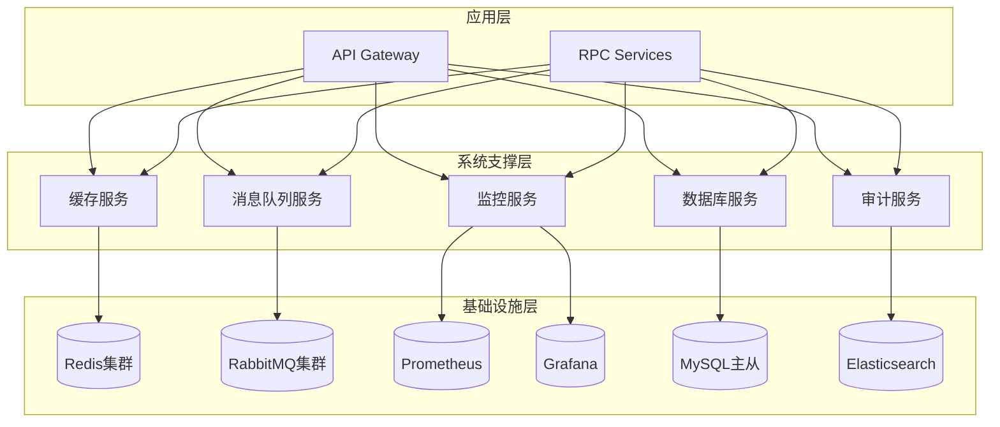

# 系统支撑功能设计文档

## 概述

系统支撑功能模块为票务平台提供关键的基础设施服务，采用微服务架构设计，确保高可用性、高性能和可观测性。模块包含5个核心接口，支持缓存管理、消息队列、监控采集、审计日志和数据库优化等功能。

## 架构设计

### 整体架构



### 服务架构

系统支撑模块采用分层架构：

1. **接口层**: 提供RPC和HTTP接口
2. **服务层**: 实现业务逻辑和数据处理
3. **适配层**: 对接各种基础设施组件
4. **基础设施层**: Redis、RabbitMQ、Prometheus等

## 组件设计

### 1. 缓存服务组件

**功能职责:**
- 申请编号和审核状态的缓存管理
- 热点数据的预加载和刷新
- 缓存穿透和雪崩防护

**技术实现:**
- Redis集群部署，支持主从复制
- 一致性哈希算法实现数据分片
- Lua脚本保证操作原子性

**接口设计:**
```go
type CacheService interface {
    Set(key string, value interface{}, expiration time.Duration) error
    Get(key string) (interface{}, error)
    Delete(key string) error
    BatchSet(items map[string]interface{}, expiration time.Duration) error
    BatchGet(keys []string) (map[string]interface{}, error)
    Exists(key string) (bool, error)
    Expire(key string, expiration time.Duration) error
}
```

### 2. 消息队列服务组件

**功能职责:**
- 审核状态变更通知的异步处理
- 系统间解耦和削峰填谷
- 消息可靠传递和重试机制

**技术实现:**
- RabbitMQ集群，支持高可用
- 消息持久化和确认机制
- 死信队列处理失败消息

**接口设计:**
```go
type MessageQueueService interface {
    Publish(exchange, routingKey string, message interface{}) error
    Subscribe(queue string, handler MessageHandler) error
    CreateQueue(queue string, options QueueOptions) error
    DeleteQueue(queue string) error
    GetQueueInfo(queue string) (*QueueInfo, error)
}
```

### 3. 监控服务组件

**功能职责:**
- 业务指标和系统指标采集
- 实时监控和告警
- 性能分析和容量规划

**技术实现:**
- Prometheus指标采集和存储
- Grafana可视化展示
- AlertManager告警管理

**接口设计:**
```go
type MonitorService interface {
    RecordMetric(name string, value float64, labels map[string]string) error
    IncrementCounter(name string, labels map[string]string) error
    RecordHistogram(name string, value float64, labels map[string]string) error
    SetGauge(name string, value float64, labels map[string]string) error
    GetMetrics(query string, timeRange TimeRange) (*MetricResult, error)
}
```

### 4. 审计服务组件

**功能职责:**
- 关键操作的完整记录
- 审计日志的查询和分析
- 合规性支持和数据保护

**技术实现:**
- Elasticsearch存储和索引
- 结构化日志格式
- 数据加密和访问控制

**接口设计:**
```go
type AuditService interface {
    LogOperation(operation AuditOperation) error
    QueryLogs(query AuditQuery) (*AuditResult, error)
    ExportLogs(query AuditQuery, format string) (string, error)
    GetStatistics(timeRange TimeRange) (*AuditStatistics, error)
}
```

### 5. 数据库服务组件

**功能职责:**
- 查询性能优化和索引管理
- 读写分离和负载均衡
- 慢查询监控和分析

**技术实现:**
- MySQL主从架构
- 连接池和查询缓存
- 索引优化和查询重写

**接口设计:**
```go
type DatabaseService interface {
    ExecuteQuery(query string, params []interface{}) (*QueryResult, error)
    ExecuteTransaction(operations []DBOperation) error
    GetIndexSuggestions(table string) ([]IndexSuggestion, error)
    AnalyzeQuery(query string) (*QueryAnalysis, error)
    GetSlowQueries(timeRange TimeRange) ([]SlowQuery, error)
}
```

## 数据模型

### 缓存数据结构

```go
type CacheItem struct {
    Key        string        `json:"key"`
    Value      interface{}   `json:"value"`
    Expiration time.Duration `json:"expiration"`
    CreatedAt  time.Time     `json:"created_at"`
}

type CacheStats struct {
    HitRate     float64 `json:"hit_rate"`
    MissRate    float64 `json:"miss_rate"`
    TotalKeys   int64   `json:"total_keys"`
    UsedMemory  int64   `json:"used_memory"`
    Connections int32   `json:"connections"`
}
```

### 消息队列数据结构

```go
type Message struct {
    ID          string                 `json:"id"`
    Exchange    string                 `json:"exchange"`
    RoutingKey  string                 `json:"routing_key"`
    Body        interface{}            `json:"body"`
    Headers     map[string]interface{} `json:"headers"`
    Priority    int32                  `json:"priority"`
    Timestamp   time.Time              `json:"timestamp"`
    RetryCount  int32                  `json:"retry_count"`
}

type QueueInfo struct {
    Name         string `json:"name"`
    Messages     int64  `json:"messages"`
    Consumers    int32  `json:"consumers"`
    MessageRate  float64 `json:"message_rate"`
    ConsumerRate float64 `json:"consumer_rate"`
}
```

### 监控指标数据结构

```go
type Metric struct {
    Name      string            `json:"name"`
    Type      string            `json:"type"` // counter, gauge, histogram
    Value     float64           `json:"value"`
    Labels    map[string]string `json:"labels"`
    Timestamp time.Time         `json:"timestamp"`
}

type MetricResult struct {
    Metrics []Metric  `json:"metrics"`
    Total   int64     `json:"total"`
    TimeRange TimeRange `json:"time_range"`
}
```

### 审计日志数据结构

```go
type AuditOperation struct {
    ID            string                 `json:"id"`
    OperationType string                 `json:"operation_type"`
    OperatorID    string                 `json:"operator_id"`
    OperatorName  string                 `json:"operator_name"`
    ResourceType  string                 `json:"resource_type"`
    ResourceID    string                 `json:"resource_id"`
    Details       map[string]interface{} `json:"details"`
    IPAddress     string                 `json:"ip_address"`
    UserAgent     string                 `json:"user_agent"`
    Timestamp     time.Time              `json:"timestamp"`
    Result        string                 `json:"result"`
}

type AuditQuery struct {
    OperationType string    `json:"operation_type,omitempty"`
    OperatorID    string    `json:"operator_id,omitempty"`
    ResourceType  string    `json:"resource_type,omitempty"`
    StartTime     time.Time `json:"start_time,omitempty"`
    EndTime       time.Time `json:"end_time,omitempty"`
    Page          int32     `json:"page"`
    PageSize      int32     `json:"page_size"`
}
```

### 数据库查询数据结构

```go
type QueryResult struct {
    Columns []string        `json:"columns"`
    Rows    [][]interface{} `json:"rows"`
    Total   int64           `json:"total"`
    Elapsed time.Duration   `json:"elapsed"`
}

type IndexSuggestion struct {
    Table       string   `json:"table"`
    Columns     []string `json:"columns"`
    IndexType   string   `json:"index_type"`
    Benefit     float64  `json:"benefit"`
    Description string   `json:"description"`
}

type SlowQuery struct {
    Query       string        `json:"query"`
    Duration    time.Duration `json:"duration"`
    Timestamp   time.Time     `json:"timestamp"`
    RowsExamined int64        `json:"rows_examined"`
    RowsSent    int64         `json:"rows_sent"`
}
```

## 错误处理

### 错误分类和处理策略

1. **网络错误**: 自动重试，指数退避
2. **超时错误**: 熔断机制，降级处理
3. **资源不足**: 限流控制，优雅降级
4. **数据错误**: 参数验证，错误返回
5. **系统错误**: 日志记录，告警通知

### 错误码定义

```go
const (
    // 缓存相关错误
    ErrCacheConnectionFailed = 2001
    ErrCacheKeyNotFound     = 2002
    ErrCacheOperationFailed = 2003
    
    // 消息队列相关错误
    ErrMQConnectionFailed   = 2101
    ErrMQPublishFailed     = 2102
    ErrMQConsumeFailed     = 2103
    
    // 监控相关错误
    ErrMonitorMetricFailed  = 2201
    ErrMonitorQueryFailed   = 2202
    
    // 审计相关错误
    ErrAuditLogFailed      = 2301
    ErrAuditQueryFailed    = 2302
    
    // 数据库相关错误
    ErrDBConnectionFailed  = 2401
    ErrDBQueryFailed       = 2402
    ErrDBTransactionFailed = 2403
)
```

## 性能设计

### 性能目标

- **缓存操作**: 响应时间 < 10ms，QPS > 10000
- **消息队列**: 吞吐量 > 5000 msg/s，延迟 < 100ms
- **监控采集**: 数据点处理 > 100000/s
- **审计日志**: 写入延迟 < 50ms，查询响应 < 1s
- **数据库查询**: 简单查询 < 100ms，复杂查询 < 1s

### 性能优化策略

1. **连接池管理**: 复用连接，减少建连开销
2. **批量操作**: 合并请求，提高吞吐量
3. **异步处理**: 非阻塞操作，提高并发能力
4. **缓存策略**: 多级缓存，减少后端压力
5. **索引优化**: 智能索引，加速查询

## 安全设计

### 安全措施

1. **访问控制**: 基于角色的权限验证
2. **数据加密**: 传输加密和存储加密
3. **审计跟踪**: 完整的操作记录
4. **输入验证**: 严格的参数校验
5. **资源隔离**: 租户数据隔离

### 合规要求

1. **数据保护**: 符合GDPR等数据保护法规
2. **审计要求**: 满足SOX等合规审计
3. **日志保留**: 按法规要求保留日志
4. **访问记录**: 完整的访问审计链

## 测试策略

### 单元测试
- 每个服务组件的核心逻辑测试
- 错误处理和边界条件测试
- Mock外部依赖进行隔离测试

### 集成测试
- 服务间接口集成测试
- 基础设施组件集成测试
- 端到端业务流程测试

### 性能测试
- 负载测试验证性能指标
- 压力测试找出系统瓶颈
- 稳定性测试验证长期运行

### 容灾测试
- 故障注入测试
- 恢复时间测试
- 数据一致性测试

## 正确性属性

*属性是系统在所有有效执行中应该保持的特征或行为——本质上是关于系统应该做什么的正式声明。属性作为人类可读规范和机器可验证正确性保证之间的桥梁。*

基于需求分析，以下是系统支撑功能的核心正确性属性：

### 属性 1: 缓存操作一致性
*对于任何*有效的键值对和过期时间，缓存设置操作后立即查询应该返回相同的值，直到过期时间到达
**验证: 需求 1.1, 1.2**

### 属性 2: 缓存批量操作原子性  
*对于任何*批量缓存操作，要么所有操作都成功，要么所有操作都失败，不存在部分成功的情况
**验证: 需求 1.5**

### 属性 3: 消息队列可靠传递
*对于任何*发布到队列的消息，如果发布成功，则消息必须能够被消费者接收，除非消息过期或被显式删除
**验证: 需求 2.1, 2.2, 2.3**

### 属性 4: 消息处理重试机制
*对于任何*处理失败的消息，系统应该按照配置的重试策略进行重试，超过最大重试次数后进入死信队列
**验证: 需求 2.4**

### 属性 5: 监控指标数据完整性
*对于任何*记录的监控指标，指标数据应该包含完整的元数据（名称、值、标签、时间戳），且能够被查询接口正确检索
**验证: 需求 3.1, 3.2, 3.5**

### 属性 6: 审计日志完整性
*对于任何*关键操作，审计日志必须包含操作人、操作时间、操作内容和操作结果等完整信息，且日志记录不可篡改
**验证: 需求 4.1, 4.2, 4.4**

### 属性 7: 数据库查询优化效果
*对于任何*复杂查询，使用索引优化后的查询执行时间应该显著小于未优化的查询执行时间
**验证: 需求 5.1, 5.4**

### 属性 8: 系统降级保护
*对于任何*外部服务故障场景，系统应该能够检测故障并启用降级策略，保持核心功能的可用性
**验证: 需求 6.1, 6.2**

### 属性 9: 并发数据一致性
*对于任何*并发操作序列，最终的数据状态应该等价于某个串行执行顺序的结果
**验证: 需求 7.3**

### 属性 10: 数据安全保护
*对于任何*包含敏感信息的数据，在存储和传输过程中应该被正确加密，在日志记录中应该被脱敏处理
**验证: 需求 8.1, 8.2**

### 属性 11: 缓存过期时间精确性
*对于任何*设置了过期时间的缓存项，在过期时间到达后查询应该返回空值或触发重新加载
**验证: 需求 1.3**

### 属性 12: 消息优先级排序
*对于任何*具有不同优先级的消息集合，高优先级消息应该优先被消费处理
**验证: 需求 2.5**

### 属性 13: 监控告警及时性
*对于任何*触发告警阈值的异常情况，监控系统应该在配置的时间窗口内发出告警通知
**验证: 需求 3.3**

### 属性 14: 审计日志查询准确性
*对于任何*审计日志查询条件，返回的结果应该完全匹配查询条件，且支持正确的分页处理
**验证: 需求 4.3**

### 属性 15: 数据库连接池效率
*对于任何*数据库操作请求，连接池应该能够复用现有连接或在合理时间内创建新连接，避免连接泄漏
**验证: 需求 7.2**

### 属性 16: 配置热更新实时性
*对于任何*配置参数的更新操作，新配置应该在指定的时间窗口内生效，且不影响正在处理的请求
**验证: 需求 6.5**

### 属性 17: 健康检查准确性
*对于任何*服务实例，健康检查结果应该准确反映服务的实际运行状态，包括依赖服务的可用性
**验证: 需求 6.4**

### 属性 18: 数据备份完整性
*对于任何*备份操作，备份数据应该与源数据保持一致，且能够在灾难恢复时完整还原
**验证: 需求 8.4**