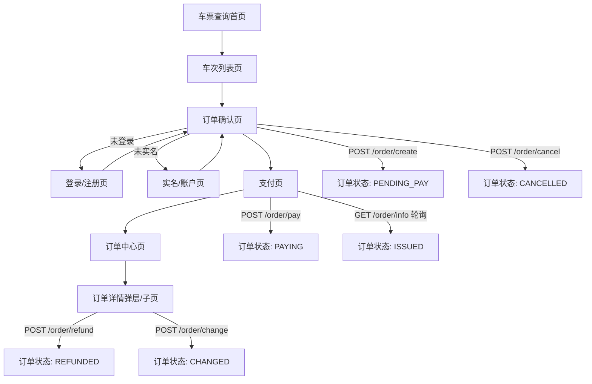

## 1. Product Overview
仿携程的火车票购票流程前端页面（查询→选车次→填乘客→下单锁座→支付→出票/取消/退改）。
基于现有 Gateway HTTP 接口实现，并明确页面跳转与订单状态流转。

## 2. Core Features

### 2.1 User Roles
| 角色 | 注册/登录方式 | 核心权限 |
|------|--------------|----------|
| 游客 | 无 | 可查询站点/车次、查看余票与价格 |
| 登录用户（未实名） | 手机号注册/登录 | 可查看个人信息；不可下单 |
| 登录用户（已实名 VERIFIED） | 登录后完成实名认证 | 可下单、支付、取消、退票、改签、查看订单 |

### 2.2 Feature Module
本购票流程最小可用版本包含以下页面：
1. **车票查询首页**：出发/到达站输入联想、日期选择、筛选入口、查询按钮。
2. **车次列表页**：车次列表、筛选/排序、余票与最低价展示、进入下单。
3. **订单确认页**：选择/填写乘客、席别确认、费用汇总、创建订单(锁座)、支付倒计时。
4. **支付页**：选择支付渠道、发起支付、展示收银台链接(如支付宝)、支付结果确认。
5. **订单中心页**：订单列表、订单详情、取消/退票/改签操作、状态展示。
6. **登录/注册页**：手机号注册、登录获取 Token。
7. **实名/账户页**：实名认证提交、个人信息查看/更新、常用乘车人列表。

### 2.3 Page Details
| Page Name | Module Name | Feature description |
|---|---|---|
| 车票查询首页 | 站点输入联想 | 调用 GET /api/v1/station/suggest?keyword=&limit=；将选择结果写入“出发/到达站”。 |
| 车票查询首页 | 查询条件 | 选择 travel_date(YYYY-MM-DD)；可选 seat_type/车次类型/出发时段/是否只看有票。 |
| 车票查询首页 | 发起查询 | 跳转车次列表页并带上查询参数（不直接创建订单）。 |
| 车次列表页 | 车次列表 | 调用 GET /api/v1/train/search（支持 cursor/limit）；展示出发/到达时间、历时、seat_price、remaining_seat_count。 |
| 车次列表页 | 筛选/排序/分页 | 按 sort=price/time/remain + direction=asc/desc；使用 next_cursor 继续加载。 |
| 车次列表页 | 车次详情与席别余票 | 点击车次时调用 GET /api/v1/train/detail?train_id=...；展示 seat_types（席别余票+最低价）。 |
| 车次列表页 | 进入下单 | 选择 train_id + 出发/到达站 + 乘客席别后进入订单确认页。 |
| 登录/注册页 | 注册 | POST /api/v1/user/register {user_name,password,phone}；成功后可引导登录。 |
| 登录/注册页 | 登录 | POST /api/v1/user/login {phone,password}；保存 token（Authorization: Bearer 或 X-Token）。 |
| 实名/账户页 | 实名认证 | POST /api/v1/user/verify_realname {real_name,id_card,phone}；成功后可下单。 |
| 实名/账户页 | 个人信息 | GET /api/v1/user/profile；未实名允许 POST /api/v1/user/profile 更新 real_name。 |
| 实名/账户页 | 常用乘车人 | GET /api/v1/user/passengers；用于订单确认页选择 passenger_id 或 use_self。 |
| 订单确认页 | 前置校验 | 若未登录→跳登录；若已登录但未实名→跳实名（否则后端下单会返回 403“未实名认证，无法购票”）。 |
| 订单确认页 | 乘客信息 | 支持：use_self=true（使用本人实名）或 passenger_id（从常用乘车人选）或手动输入 real_name/id_card。 |
| 订单确认页 | 创建订单(锁座) | POST /api/v1/order/create {train_id,departure_station,arrival_station,passengers:[{...seat_type}]}；获得 order_id、pay_deadline_unix、seats(锁座结果)。 |
| 订单确认页 | 倒计时与取消 | 显示 pay_deadline_unix 倒计时；用户可 POST /api/v1/order/cancel {order_id} 释放锁座。 |
| 支付页 | 发起支付 | POST /api/v1/order/pay {order_id,pay_channel}；若 pay_channel=ALIPAY 且成功，响应可能携带 pay_url。 |
| 支付页 | 支付结果确认 | 轮询 GET /api/v1/order/info?order_id=... 直到 order_status 进入 ISSUED/CANCELLED；测试环境可用 POST /api/v1/pay/mock_notify 触发回调。 |
| 订单中心页 | 订单列表 | GET /api/v1/order/list?status=&cursor=&limit=；展示 order_status、total_amount、pay_deadline_unix、created_at_unix。 |
| 订单中心页 | 订单详情 | GET /api/v1/order/info?order_id=...；展示 seats（座位号/车厢/价格）。 |
| 订单中心页 | 退票/改签 | POST /api/v1/order/refund {order_id,reason?}；POST /api/v1/order/change {order_id,new_train_id,new_departure_station,new_arrival_station}。 |

## 3. Core Process
1) 游客在“车票查询首页”选择出发站/到达站/日期，进入“车次列表页”。
2) 在“车次列表页”筛选席别并查看余票/价格；选择目标车次与席别进入“订单确认页”。
3) 若未登录，跳“登录/注册页”；登录成功后返回订单确认页。
4) 若未实名，跳“实名/账户页”完成实名认证；成功后返回订单确认页。
5) 订单确认页填写/选择乘客信息，调用“创建订单”锁座，生成待支付订单并展示支付倒计时。
6) 进入支付页发起支付；支付完成后通过轮询订单详情确认出票。
7) 订单中心页可查看订单状态，并支持取消（未支付）、退票（已出票）、改签（按后端规则生成新订单）。

订单状态（后端已有定义）：
- PENDING_PAY 待支付 →（发起支付）PAYING 支付中 →（回调确认/支付成功）ISSUED 已出票
- PENDING_PAY/PAYING →（用户取消或超时）CANCELLED 已取消
- ISSUED →（退票）REFUNDED 已退票
- ISSUED →（改签）CHANGED 已改签（通常会生成 new_order_id）

