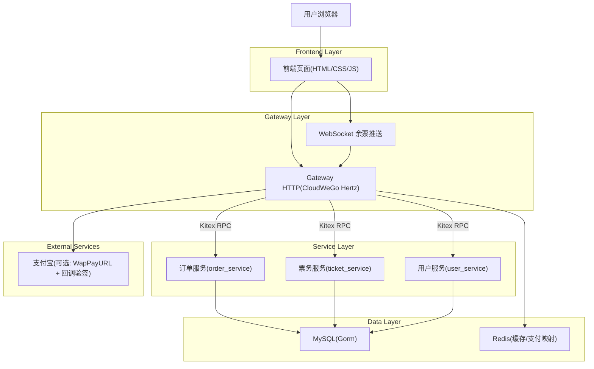
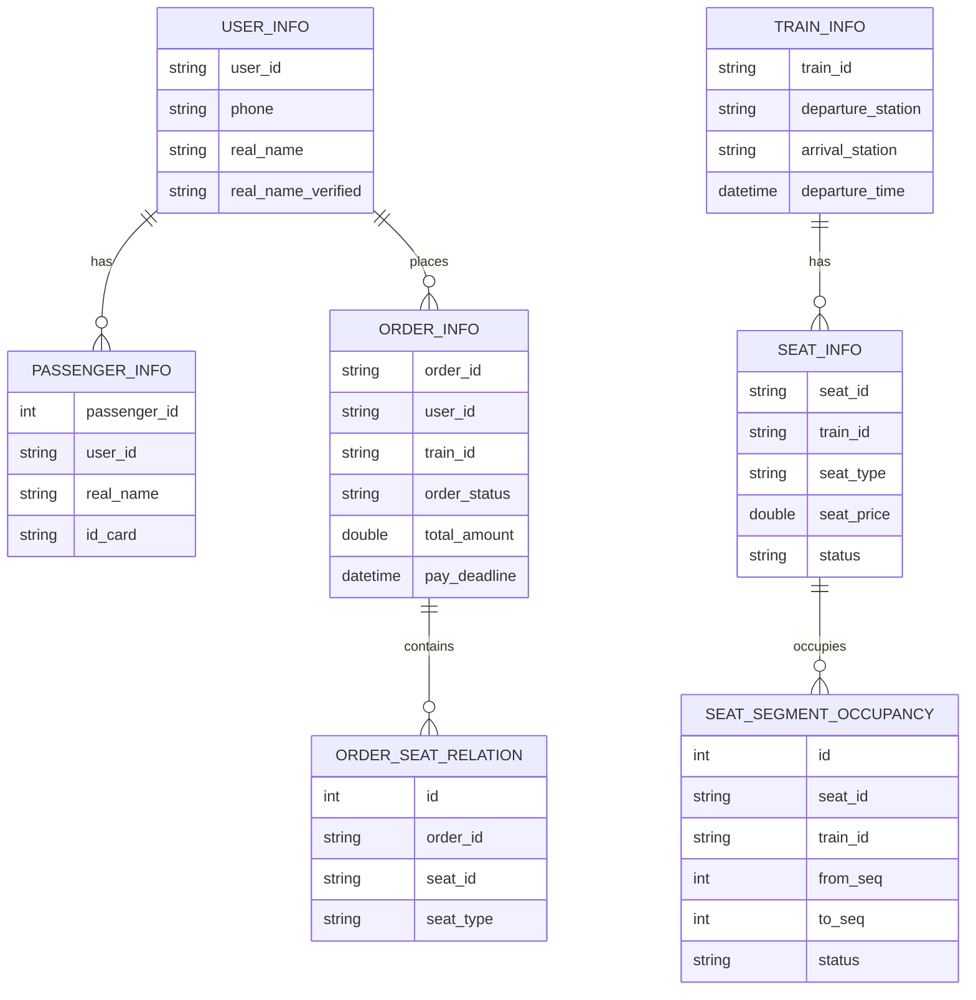

## 1.Architecture design


## 2.Technology Description
- Frontend: 原生 HTML + CSS + JavaScript（由 Gateway 提供静态资源；可按需演进为 React SPA）
- Backend: Go@1.24 + CloudWeGo Hertz(HTTP Gateway) + Kitex(RPC 微服务)
- Database: MySQL（Gorm ORM）
- Cache/Realtime: Redis（查询缓存、余票/价格缓存、支付临时映射）+ WebSocket（余票推送）
- Auth: JWT（Header: Authorization Bearer / X-Token）
- Payment: Alipay SDK（可选；支付 URL 生成 + 回调验签 + 订单确认）

## 3.Route definitions
| Route | Purpose |
|---|---|
| / | 车票查询首页（加载 web/index.html + web/app.js） |
| /#/trains | 车次列表页（读取 query 条件并调用 /train/search、/train/detail） |
| /#/order/confirm | 订单确认页（乘客选择/填写，调用 /order/create） |
| /#/pay | 支付页（调用 /order/pay，展示 pay_url，轮询 /order/info） |
| /#/orders | 订单中心页（调用 /order/list，进入详情） |
| /#/orders/:orderId | 订单详情（调用 /order/info，发起 cancel/refund/change） |
| /#/login | 登录/注册页（调用 /user/register、/user/login） |
| /#/account | 实名/账户页（调用 /user/profile、/user/verify_realname、/user/passengers） |

## 4.API definitions (If it includes backend services)
### 4.1 前端对接的 Gateway HTTP API（摘要）
- Auth 约定：
  - Header: Authorization: Bearer <token>（或 X-Token: <token>）
  - 登录成功返回 token，后续接口在网关鉴权中解析并注入 X-User-ID

- 站点联想
  - GET /api/v1/station/suggest?keyword=&limit=

- 车次查询 / 车次详情
  - GET /api/v1/train/search?departure_station=&arrival_station=&travel_date=&seat_type=&cursor=&limit=
  - GET /api/v1/train/detail?train_id=&departure_station=&arrival_station=
  - GET /api/v1/ticket/ws?train_id=&seat_type=&travel_date=（WebSocket 推送 remaining）

- 账号与实名
  - POST /api/v1/user/register
  - POST /api/v1/user/login
  - POST /api/v1/user/verify_realname（需登录）
  - GET /api/v1/user/profile（需登录）
  - GET /api/v1/user/passengers（需登录）

- 订单域
  - POST /api/v1/order/create（需登录+实名 VERIFIED；返回 pay_deadline_unix）
  - POST /api/v1/order/pay（需登录；pay_channel=ALIPAY 时可能返回 pay_url）
  - GET /api/v1/order/info（需登录；轮询确认出票）
  - GET /api/v1/order/list（需登录；cursor 分页）
  - POST /api/v1/order/cancel /refund /change（需登录）
  - POST /api/v1/pay/mock_notify（需登录；仅测试，模拟回调）

### 4.2 推荐给前端的 TypeScript 类型（与现有 JSON 对齐）
```ts
export type BaseResp = { code: number; msg: string };

export type TrainSearchItem = {
  train_id: string;
  train_type: string;
  departure_station: string;
  arrival_station: string;
  departure_time: string; // RFC3339
  arrival_time: string;   // RFC3339
  runtime_minutes: number;
  seat_type: string;
  seat_price: number;
  remaining_seat_count: number;
};

export type CreateOrderPassenger = {
  passenger_id?: number;
  use_self?: boolean;
  real_name?: string;
  id_card?: string;
  seat_type: string;
};

export type CreateOrderResp = BaseResp & {
  order_id: string;
  pay_deadline_unix: number;
  seats: Array<{ seat_id: string; seat_type: string; carriage_num: string; seat_num: string; seat_price: number }>;
};

export type OrderInfo = {
  order_id: string;
  train_id: string;
  departure_station: string;
  arrival_station: string;
  total_amount: number;
  order_status: "PENDING_PAY"|"PAYING"|"ISSUED"|"CANCELLED"|"REFUNDED"|"CHANGED"|string;
  pay_deadline_unix: number;
  created_at_unix: number;
};
```

## 6.Data model(if applicable)
### 6.1 Data model definition


### 6.2 Data Definition Language
（仅列购票流程强相关字段，实际以项目内 Gorm Model 为准）
```sql
CREATE TABLE order_info (
  order_id VARCHAR(64) PRIMARY KEY,
  user_id VARCHAR(64) NOT NULL,
  train_id VARCHAR(32) NOT NULL,
  departure_station VARCHAR(64) NOT NULL,
  arrival_station VARCHAR(64) NOT NULL,
  total_amount DECIMAL(10,2) NOT NULL,
  order_status VARCHAR(20) NOT NULL,
  pay_deadline DATETIME NULL,
  pay_time DATETIME NULL,
  pay_channel VARCHAR(16) NULL,
  pay_no VARCHAR(64) NULL,
  created_at DATETIME NOT NULL,
  updated_at DATETIME NOT NULL
);
```
