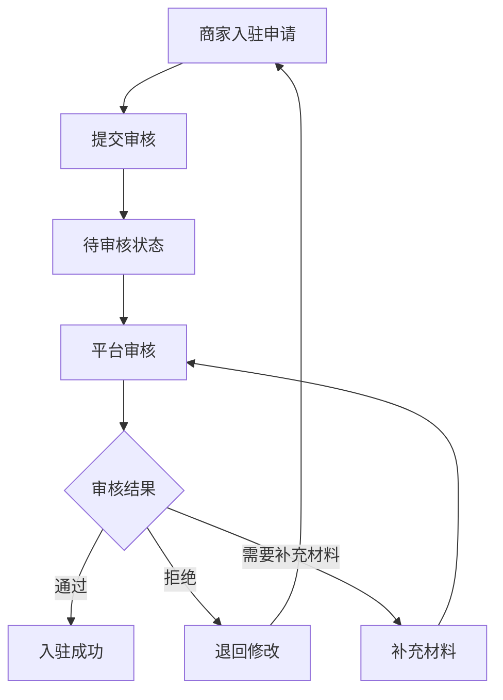

## 1. 产品概述
票务系统商家入驻模块是一个为票务平台商家提供入驻申请、资质审核和管理功能的系统。该模块帮助平台管理商家入驻流程，确保商家资质合规，同时为商家提供便捷的入驻申请渠道。

目标用户为票务平台运营人员和申请入驻的商家，通过标准化流程提升入驻效率和审核质量。

## 2. 核心功能

### 2.1 用户角色
| 角色 | 注册方式 | 核心权限 |
|------|----------|----------|
| 商家用户 | 邮箱/手机号注册 | 提交入驻申请、查看审核状态、编辑申请信息 |
| 平台审核员 | 内部账号分配 | 审核商家资质、处理入驻申请、管理商家状态 |
| 平台管理员 | 内部账号分配 | 查看所有申请、导出数据、系统配置 |

### 2.2 功能模块
票务系统商家入驻模块包含以下核心页面：
1. **商家入驻申请页面**：基本信息填写、资质文件上传
2. **申请列表管理页面**：申请记录查看、搜索筛选、状态管理
3. **资质审核页面**：人工审核流程、文档查看、审核操作

### 2.3 页面详情
| 页面名称 | 模块名称 | 功能描述 |
|----------|----------|----------|
| 商家入驻申请 | 基本信息组 | 填写商家名称、联系人信息，支持下拉选择和自动填充 |
| 商家入驻申请 | 资质信息组 | 上传营业执照、经营许可证等资质文件，支持拖拽上传和预览 |
| 商家入驻申请 | 操作按钮 | 提交申请、保存草稿功能，表单验证和状态管理 |
| 申请列表管理 | 搜索筛选 | 按日期、状态、区域等条件筛选申请记录 |
| 申请列表管理 | 数据表格 | 展示申请列表，包含日期、编号、状态等关键信息 |
| 申请列表管理 | 快捷操作 | 查看详情、编辑、删除等批量操作功能 |
| 申请列表管理 | 侧边导航 | 系统主要功能模块的快速切换 |
| 资质审核 | 审核流程 | 显示当前审核进度，支持流程节点导航 |
| 资质审核 | 文档查看器 | 轮播展示资质文件，支持放大缩小和全屏查看 |
| 资质审核 | 审核操作 | 填写审核意见、选择审核结果、通过/拒绝操作 |

## 3. 核心流程

### 商家用户流程
商家用户登录系统后，进入入驻申请页面填写基本信息和上传资质文件，提交后可在申请列表查看审核进度和结果。

### 审核员流程
审核员在申请列表中选择待审核的申请，进入资质审核页面查看商家信息和资质文件，填写审核意见并做出审核决定。

## 4. 用户界面设计

### 4.1 设计风格
- **主色调**：深蓝色 (#1e3a8a) 作为主色，橙色 (#f97316) 作为强调色
- **按钮样式**：圆角矩形设计，主要操作为渐变填充（橙到红）
- **字体**：中文使用思源黑体，英文字体使用Roboto
- **布局风格**：卡片式布局，左右分栏结构，阴影效果增强层次感
- **图标风格**：使用线性图标，简洁现代，支持SVG格式

### 4.2 页面设计概述
| 页面名称 | 模块名称 | UI元素 |
|----------|----------|--------|
| 商家入驻申请 | 基本信息卡片 | 白色圆角卡片，浅灰色输入框边框，下拉箭头图标右对齐 |
| 商家入驻申请 | 资质上传区域 | 浅灰色虚线框，文档图标居中，橙色渐变上传按钮 |
| 商家入驻申请 | 操作按钮组 | 左侧深蓝色提交按钮，右侧白色边框保存按钮，圆角设计 |
| 申请列表管理 | 搜索栏 | 浅灰色背景，搜索框带放大镜图标，下拉筛选器 |
| 申请列表管理 | 数据表格 | 交替行背景色，状态标签彩色显示（绿色通过、橙色待审核） |
| 申请列表管理 | 侧边导航 | 深蓝色背景，白色文字，当前选中项蓝色高亮 |
| 资质审核 | 审核流程 | 垂直流程图，红色虚线连接，当前步骤红色高亮 |
| 资质审核 | 文档查看器 | 轮播图形式，缩略图底部排列，支持点击查看大图 |
| 资质审核 | 审核表单 | 右侧深色面板，白色表单元素，蓝绿色操作按钮 |

### 4.3 响应式设计
采用桌面端优先设计，适配1024px以上屏幕。移动端采用自适应布局，重要功能在移动端保持可用性，触摸交互优化，支持手势操作。

### 4.4 交互设计
- 表单验证实时反馈，错误提示使用红色边框和文字
- 文件上传显示进度条，支持拖拽上传
- 表格行悬停高亮，支持批量选择和操作
- 模态框显示重要操作确认，避免误操作