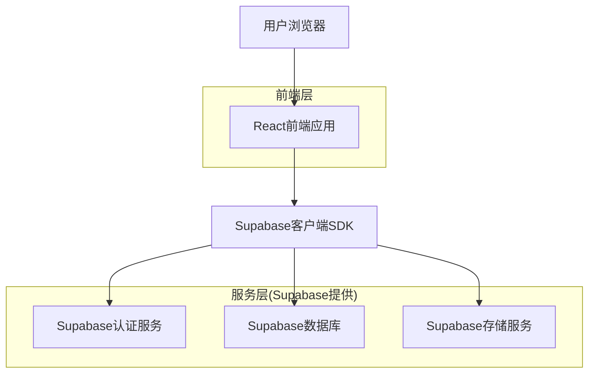
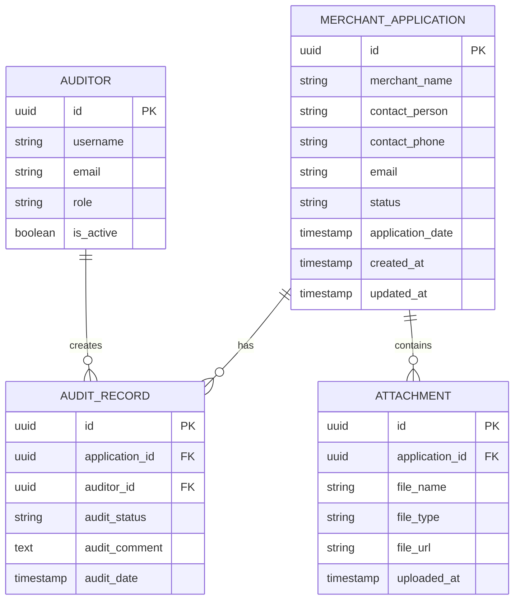

## 1. 架构设计



## 2. 技术描述

* **前端**: React\@18 + TypeScript + TailwindCSS + Vite

* **初始化工具**: vite-init

* **后端**: Supabase (BaaS)

* **UI组件库**: HeadlessUI + Heroicons

* **状态管理**: React Context + useReducer

* **表单验证**: React Hook Form + Zod

## 3. 路由定义

| 路由                     | 用途               |
| ---------------------- | ---------------- |
| /merchant/apply        | 商家入驻申请页面，填写申请信息  |
| /merchant/applications | 申请列表页面，查看和管理申请记录 |
| /merchant/audit/:id    | 资质审核页面，审核具体申请    |
| /merchant/dashboard    | 商家仪表板，查看申请状态统计   |
| /login                 | 登录页面，支持商家和管理员登录  |

## 4. API定义

### 4.1 商家入驻申请API

**创建申请**

```
POST /api/merchant/applications
```

请求参数:

| 参数名                 | 参数类型   | 是否必需 | 描述     |
| ------------------- | ------ | ---- | ------ |
| merchant\_name      | string | 是    | 商家名称   |
| contact\_person     | string | 是    | 联系人姓名  |
| contact\_phone      | string | 是    | 联系电话   |
| business\_license   | file   | 是    | 营业执照文件 |
| permit\_certificate | file   | 否    | 经营许可证  |

响应:

| 参数名             | 参数类型      | 描述                              |
| --------------- | --------- | ------------------------------- |
| application\_id | string    | 申请唯一标识                          |
| status          | string    | 申请状态(pending/approved/rejected) |
| created\_at     | timestamp | 创建时间                            |

### 4.2 申请列表查询API

**获取申请列表**

```
GET /api/merchant/applications
```

查询参数:

| 参数名         | 参数类型   | 是否必需 | 描述        |
| ----------- | ------ | ---- | --------- |
| page        | number | 否    | 页码，默认1    |
| limit       | number | 否    | 每页条数，默认20 |
| status      | string | 否    | 状态筛选      |
| start\_date | date   | 否    | 开始日期      |
| end\_date   | date   | 否    | 结束日期      |
| search      | string | 否    | 搜索关键词     |

### 4.3 资质审核API

**更新审核状态**

```
PUT /api/merchant/applications/:id/audit
```

请求参数:

| 参数名            | 参数类型   | 是否必需 | 描述                      |
| -------------- | ------ | ---- | ----------------------- |
| audit\_status  | string | 是    | 审核结果(approved/rejected) |
| audit\_comment | string | 是    | 审核意见                    |
| auditor\_id    | string | 是    | 审核员ID                   |

## 5. 数据模型

### 5.1 数据模型定义



### 5.2 数据定义语言

**商家申请表 (merchant\_applications)**

```sql
-- 创建商家申请表
CREATE TABLE merchant_applications (
    id UUID PRIMARY KEY DEFAULT gen_random_uuid(),
    merchant_name VARCHAR(255) NOT NULL,
    contact_person VARCHAR(100) NOT NULL,
    contact_phone VARCHAR(20) NOT NULL,
    email VARCHAR(255),
    status VARCHAR(20) DEFAULT 'pending' CHECK (status IN ('pending', 'approved', 'rejected', 'draft')),
    application_date DATE DEFAULT CURRENT_DATE,
    created_at TIMESTAMP WITH TIME ZONE DEFAULT NOW(),
    updated_at TIMESTAMP WITH TIME ZONE DEFAULT NOW()
);

-- 创建索引
CREATE INDEX idx_merchant_applications_status ON merchant_applications(status);
CREATE INDEX idx_merchant_applications_created_at ON merchant_applications(created_at DESC);
CREATE INDEX idx_merchant_applications_merchant_name ON merchant_applications(merchant_name);

-- 设置权限
GRANT SELECT ON merchant_applications TO anon;
GRANT ALL PRIVILEGES ON merchant_applications TO authenticated;
```

**审核记录表 (audit\_records)**

```sql
-- 创建审核记录表
CREATE TABLE audit_records (
    id UUID PRIMARY KEY DEFAULT gen_random_uuid(),
    application_id UUID REFERENCES merchant_applications(id) ON DELETE CASCADE,
    auditor_id UUID REFERENCES auth.users(id),
    audit_status VARCHAR(20) CHECK (audit_status IN ('approved', 'rejected', 'returned')),
    audit_comment TEXT,
    audit_date TIMESTAMP WITH TIME ZONE DEFAULT NOW()
);

-- 创建索引
CREATE INDEX idx_audit_records_application_id ON audit_records(application_id);
CREATE INDEX idx_audit_records_auditor_id ON audit_records(auditor_id);
CREATE INDEX idx_audit_records_audit_date ON audit_records(audit_date DESC);

-- 设置权限
GRANT SELECT ON audit_records TO anon;
GRANT ALL PRIVILEGES ON audit_records TO authenticated;
```

**附件表 (attachments)**

```sql
-- 创建附件表
CREATE TABLE attachments (
    id UUID PRIMARY KEY DEFAULT gen_random_uuid(),
    application_id UUID REFERENCES merchant_applications(id) ON DELETE CASCADE,
    file_name VARCHAR(255) NOT NULL,
    file_type VARCHAR(50) NOT NULL,
    file_url TEXT NOT NULL,
    file_size INTEGER,
    uploaded_at TIMESTAMP WITH TIME ZONE DEFAULT NOW()
);

-- 创建索引
CREATE INDEX idx_attachments_application_id ON attachments(application_id);
CREATE INDEX idx_attachments_file_type ON attachments(file_type);

-- 设置权限
GRANT SELECT ON attachments TO anon;
GRANT ALL PRIVILEGES ON attachments TO authenticated;
```

### 5.3 行级安全策略

**商家申请表安全策略**

```sql
-- 商家只能查看自己的申请
CREATE POLICY "商家查看自己的申请" ON merchant_applications
    FOR SELECT USING (
        auth.uid() = created_by OR 
        EXISTS (
            SELECT 1 FROM auth.users 
            WHERE auth.users.id = auth.uid() 
            AND auth.users.role = 'auditor'
        )
    );

-- 审核员可以更新申请状态
CREATE POLICY "审核员更新申请" ON merchant_applications
    FOR UPDATE USING (
        EXISTS (
            SELECT 1 FROM auth.users 
            WHERE auth.users.id = auth.uid() 
            AND auth.users.role = 'auditor'
        )
    );
```

