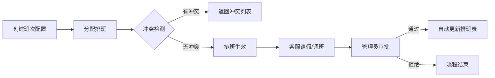
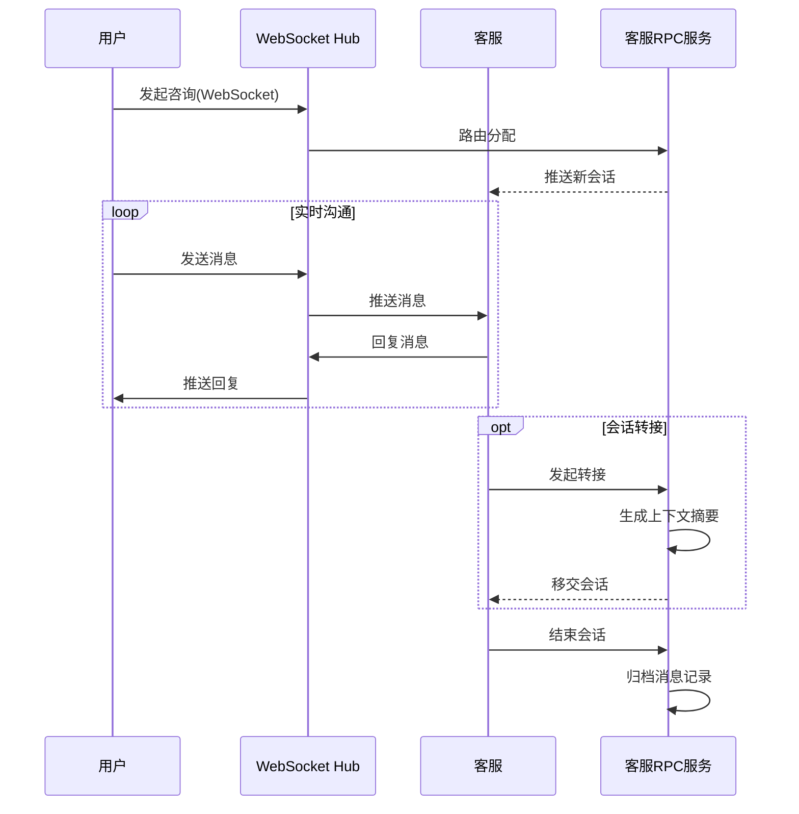
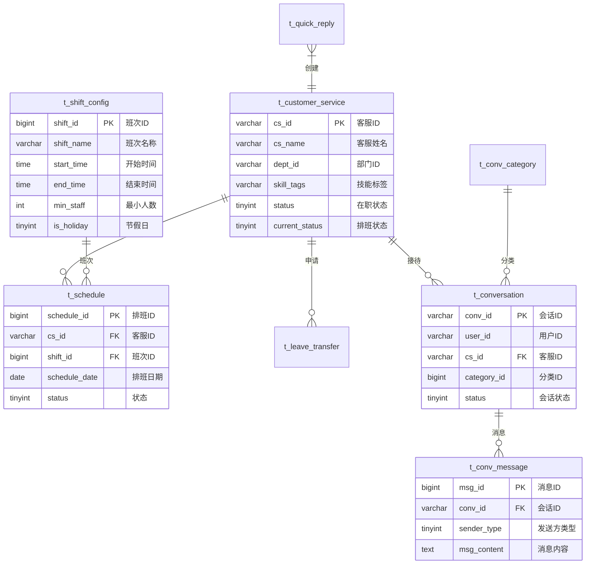

# 客服排班会话管理系统 (Piaowu)

> 基于 Go 微服务架构的企业级客服管理平台，提供智能排班调度、实时会话接待、数据统计分析等核心能力

---

## 📖 项目简介

本系统是面向客服中心的一体化管理平台，采用 **Gateway + RPC** 微服务架构，解决客服团队日常运营中的三大核心问题：

| 业务痛点 | 解决方案 |
|---------|---------|
| **排班调度复杂** | 智能排班引擎 + 冲突检测 + 人数预警 |
| **会话响应效率低** | WebSocket 实时通信 + 会话转接 + 快捷回复 |
| **数据分析困难** | 多维统计看板 + Excel 导出 + 会话分类标签 |

---

## 🏢 业务架构

### 核心业务域

```
┌────────────────────────────────────────────────────────────────┐
│                       客服排班会话管理系统                        │
├──────────────────┬──────────────────┬──────────────────────────┤
│   📅 排班管理      │   💬 会话管理      │   📊 数据管理            │
├──────────────────┼──────────────────┼──────────────────────────┤
│ • 班次配置        │ • 实时会话接待    │ • 会话分类标签           │
│ • 排班分配        │ • 会话转接        │ • 统计分析看板           │
│ • 请假调班审批    │ • 快捷回复配置    │ • 数据检索导出           │
│ • 自动排班        │ • 消息历史        │ • 核心会话标记           │
└──────────────────┴──────────────────┴──────────────────────────┘
```

### 业务流程

#### 1. 排班管理流程



**关键能力：**
- **班次配置**：支持早班/中班/晚班/夜班自定义，配置时间范围和最小在岗人数
- **冲突检测**：同一客服同一天不可分配多个班次，系统自动拦截
- **审批联动**：请假/调班审批通过后自动修正排班记录和客服状态

#### 2. 会话管理流程



**关键能力：**
- **实时通信**：基于 WebSocket 的双向实时消息推送
- **智能转接**：转接时自动携带最近10条消息作为上下文摘要
- **快捷回复**：按分类配置常用话术，提升回复效率

---

## 🏗️ 技术架构

### 整体架构

```
┌───────────────────────────────────────────────────────────────────┐
│                         客户端层                                   │
│  ┌──────────────┐  ┌──────────────┐  ┌──────────────┐            │
│  │  APP/小程序   │  │   Web 管理台  │  │    H5 页面    │            │
│  └──────┬───────┘  └──────┬───────┘  └──────┬───────┘            │
└─────────┼─────────────────┼─────────────────┼────────────────────┘
          │ HTTP REST       │ HTTP REST       │ WebSocket
          └─────────────────┴─────────────────┘
                            │
┌───────────────────────────┼───────────────────────────────────────┐
│                    API Gateway (8081)                             │
│  ┌─────────────┐  ┌─────────────┐  ┌─────────────┐                │
│  │ JWT 认证     │  │ CORS 中间件  │  │ TraceID 注入 │                │
│  └─────────────┘  └─────────────┘  └─────────────┘                │
│  ┌─────────────────────────────────────────────────────────────┐  │
│  │                    WebSocket Hub                             │  │
│  │  • 连接管理   • 消息路由   • 在线状态统计                      │  │
│  └─────────────────────────────────────────────────────────────┘  │
└───────────────────────────┬───────────────────────────────────────┘
                            │ Kitex RPC (Thrift协议)
┌───────────────────────────┼───────────────────────────────────────┐
│                Customer RPC Service (8888)                        │
│  ┌─────────────────────────────────────────────────────────────┐  │
│  │                    业务逻辑层                                 │  │
│  │  • 排班管理   • 会话管理   • 快捷回复   • 数据统计   • 用户认证 │  │
│  └─────────────────────────────────────────────────────────────┘  │
│  ┌─────────────────────────────────────────────────────────────┐  │
│  │                    数据访问层 (DAL)                          │  │
│  │  • GORM ORM   • Redis 缓存   • 链路追踪插件                   │  │
│  └─────────────────────────────────────────────────────────────┘  │
└───────────────────────────┬───────────────────────────────────────┘
                            │
┌───────────────────────────┼───────────────────────────────────────┐
│                       数据存储层                                   │
│  ┌─────────────────────┐  ┌─────────────────────┐                 │
│  │       MySQL         │  │        Redis        │                 │
│  │  • 业务数据持久化     │  │  • 热点数据缓存      │                 │
│  │  • 事务保证          │  │  • 会话状态存储      │                 │
│  └─────────────────────┘  └─────────────────────┘                 │
└───────────────────────────────────────────────────────────────────┘
```

### 技术栈

| 层级 | 技术 | 版本 | 用途 |
|------|------|------|------|
| **编程语言** | Go | 1.25.5 | 后端服务开发 |
| **RPC框架** | Kitex | v0.15.4 | 字节跳动高性能RPC框架 |
| **序列化协议** | Thrift | - | IDL定义与代码生成 |
| **ORM框架** | GORM | v1.31.1 | 数据库对象映射 |
| **数据库** | MySQL | 8.0+ | 核心业务数据存储 |
| **缓存** | Redis | 6.0+ | 热点数据缓存 |
| **实时通信** | WebSocket | gorilla/websocket v1.5.3 | 双向实时消息 |
| **身份认证** | JWT | golang-jwt v5.3.0 | Token认证 |
| **配置管理** | Viper | v1.21.0 | 多格式配置解析 |
| **日志框架** | Zap | v1.27.0 | 结构化日志 |
| **Excel处理** | Excelize | v2.10.0 | 数据导入导出 |
| **前端框架** | Uni-app + Vue 3 | - | 跨端前端应用 |

### 核心设计模式

#### 1. Gateway + RPC 分层架构

```
职责分离：
├── Gateway (网关层)
│   ├── HTTP/WebSocket 协议处理
│   ├── 请求参数校验与转换
│   ├── JWT 身份认证
│   ├── 跨域处理 (CORS)
│   └── 请求路由与限流
│
└── RPC Service (服务层)
    ├── 核心业务逻辑实现
    ├── 数据库事务管理
    ├── 缓存策略控制
    └── 业务规则校验
```

#### 2. 缓存设计策略

| 缓存键 | 数据类型 | TTL | 失效策略 |
|--------|---------|-----|---------|
| `customer:shift_config:all:v1` | 所有班次配置 | 30分钟 | 更新/删除时主动清除 |
| `customer:conv_category:all:v1` | 所有会话分类 | 30分钟 | 更新时主动清除 |
| `customer:conv_tag:all:v1` | 所有会话标签 | 60分钟 | 变更时主动清除 |
| `customer:quick_reply:list:*` | 快捷回复列表 | 5分钟 | 自然过期 |

#### 3. 链路追踪

- **TraceID 生成**：Gateway 中间件为每个请求生成唯一 TraceID
- **上下文传递**：通过 `context.Context` 在服务间传递
- **GORM 插件**：自动将 TraceID 注入 SQL 执行日志
- **日志关联**：所有日志均携带 TraceID，支持全链路问题定位

---

## 📁 项目结构

```
piaowu/
├── gateway/                          # API 网关服务
│   ├── config/                       # 网关配置
│   │   └── config.yaml               # Gateway 服务配置
│   ├── handler/                      # HTTP 请求处理器
│   │   └── customer_handler.go       # 客服业务 HTTP 处理 (1600+ 行)
│   ├── middleware/                   # 中间件
│   │   ├── auth.go                   # JWT 认证
│   │   ├── cors.go                   # 跨域处理
│   │   └── trace.go                  # TraceID 注入
│   ├── router/                       # 路由配置
│   │   └── router.go                 # 路由注册 (30+ 接口)
│   ├── rpc/                          # RPC 客户端封装
│   │   └── customer_client.go        # Customer 服务客户端
│   ├── ws/                           # WebSocket 模块
│   │   ├── hub.go                    # 连接管理与消息分发
│   │   └── client.go                 # WebSocket 客户端
│   └── main.go                       # 网关入口
│
├── service/customer/                 # 客服 RPC 服务
│   ├── config/                       # 服务配置
│   │   └── config.yaml               # MySQL/Redis 配置
│   ├── dal/                          # 数据访问层
│   │   ├── db.go                     # GORM 数据库初始化
│   │   ├── redis.go                  # Redis 客户端封装
│   │   └── plugin/trace.go           # GORM 链路追踪插件
│   ├── handler/                      # RPC 服务实现
│   │   └── handler.go                # 核心业务逻辑 (2300+ 行)
│   ├── model/                        # 数据模型
│   │   ├── model.go                  # 业务表模型 (9 张表)
│   │   └── auth.go                   # 用户认证模型
│   ├── idl/                          # Thrift IDL 定义
│   │   └── customer.thrift           # 服务接口定义 (538 行)
│   ├── kitex_gen/                    # Kitex 生成代码
│   └── main.go                       # RPC 服务入口
│
├── web/                              # 前端应用 (Uni-app)
│   ├── pages/                        # 页面目录
│   │   ├── login/                    # 登录页
│   │   ├── register/                 # 注册页
│   │   ├── index/                    # 主页
│   │   ├── schedule/                 # 排班管理
│   │   ├── shift/                    # 班次配置
│   │   ├── leave/                    # 请假调班
│   │   └── conversation/             # 会话管理
│   └── components/                   # 公共组件
│
├── pkg/                              # 公共工具包
│   └── logger/                       # 日志工具
│
├── scripts/                          # 脚本工具
│   ├── run_gateway_new.bat           # Windows 启动脚本
│   └── migrate_new.go                # 数据迁移工具
│
├── go.mod                            # Go 模块依赖
└── README.md                         # 项目文档
```

---

## 💾 数据模型

### ER 关系图



### 核心数据表

| 表名 | 说明 | 关键索引 |
|------|------|---------|
| `t_shift_config` | 班次配置表 | `(shift_name, is_holiday)` |
| `t_customer_service` | 客服信息表 | `(cs_id, dept_id)` |
| `t_schedule` | 排班记录表 | `(cs_id, schedule_date)`, `(schedule_date, shift_id)` |
| `t_leave_transfer` | 请假调班申请表 | `(cs_id, approval_status)` |
| `t_conversation` | 会话表 | `(user_id, start_time)`, `(cs_id, start_time)` |
| `t_conv_message` | 会话消息表 | `(conv_id, send_time)` |
| `t_quick_reply` | 快捷回复表 | `(reply_type, is_public)` |
| `t_conv_category` | 会话分类表 | `UNIQUE(category_name)` |
| `t_conv_tag` | 会话标签表 | `UNIQUE(tag_name)` |

---

## 🔌 API 接口

### 接口分类

#### 认证接口

| 方法 | 路径 | 说明 |
|------|------|------|
| POST | `/api/v1/user/login` | 用户登录 |
| POST | `/api/v1/user/register` | 用户注册 |
| GET | `/api/v1/user/current` | 获取当前用户 |

#### 客服管理

| 方法 | 路径 | 说明 |
|------|------|------|
| GET | `/api/customer/get` | 获取客服信息 |
| GET | `/api/customer/list` | 客服列表查询 |

#### 班次配置

| 方法 | 路径 | 说明 |
|------|------|------|
| POST | `/api/shift/create` | 创建班次 |
| GET | `/api/shift/list` | 班次列表 |
| POST | `/api/shift/update` | 更新班次 |
| POST | `/api/shift/delete` | 删除班次 |

#### 排班管理

| 方法 | 路径 | 说明 |
|------|------|------|
| POST | `/api/schedule/assign` | 分配排班 |
| POST | `/api/schedule/auto` | 自动排班 |
| GET | `/api/schedule/grid` | 排班表格数据 |
| POST | `/api/schedule/cell/upsert` | 更新排班单元格 |
| GET | `/api/schedule/export` | 导出 Excel |

#### 请假调班

| 方法 | 路径 | 说明 |
|------|------|------|
| POST | `/api/leave/apply` | 提交申请 |
| POST | `/api/leave/approve` | 审批申请 |
| GET | `/api/leave/get` | 获取申请详情 |
| GET | `/api/leave/list` | 申请列表 |

#### 会话管理

| 方法 | 路径 | 说明 |
|------|------|------|
| GET | `/api/conversation/list` | 会话列表 |
| GET | `/api/conversation/history/list` | 历史会话 |
| POST | `/api/conversation/transfer` | 会话转接 |
| GET | `/api/conversation/message/list` | 消息列表 |
| POST | `/api/conversation/message/send` | 发送消息 |
| GET | `/api/conversation/stats` | 统计数据 |

#### WebSocket

| 路径 | 说明 |
|------|------|
| `/ws?token=xxx` | WebSocket 连接端点 |

---

## 🚀 快速开始

### 环境要求

- **Go**: 1.25.5+
- **MySQL**: 8.0+
- **Redis**: 6.0+
- **Node.js**: 16+ (前端开发可选)

### 1. 克隆项目

```bash
git clone <repository-url>
cd piaowu
```

### 2. 安装依赖

```bash
go mod download
```

### 3. 配置数据库

创建数据库：

```sql
CREATE DATABASE piaowu_db CHARACTER SET utf8mb4 COLLATE utf8mb4_unicode_ci;
```

编辑 `service/customer/config/config.yaml`：

```yaml
mysql:
  host: 127.0.0.1
  port: 3306
  user: root
  password: your_password
  database: piaowu_db

redis:
  host: 127.0.0.1
  port: 6379
  password: ""
  db: 0
```

### 4. 数据迁移

```bash
go run scripts/migrate_new.go
```

### 5. 启动服务

**启动 RPC 服务：**

```bash
cd service/customer
go run main.go
# 输出: Customer service started at 0.0.0.0:8888
```

**启动 Gateway：**

```bash
cd gateway
go run main.go
# 输出: Gateway started at 0.0.0.0:8081
```

### 6. 验证服务

```bash
# 健康检查
curl http://localhost:8081/health
# 返回: OK
```

---

## 🔧 配置说明

### Gateway 配置

`gateway/config/config.yaml`：

```yaml
server:
  address: 0.0.0.0:8081          # Gateway 监听地址

services:
  customer:
    name: customer-service       # RPC 服务名称
    address: 127.0.0.1:8888      # RPC 服务地址

jwt:
  secret: piaowu-secret-key      # JWT 签名密钥
  expire_hours: 24               # Token 过期时间
```

### RPC 服务配置

`service/customer/config/config.yaml`：

```yaml
server:
  name: customer-service
  address: 0.0.0.0:8888

mysql:
  host: 127.0.0.1
  port: 3306
  user: root
  password: your_password
  database: piaowu_db
  max_idle_conns: 10
  max_open_conns: 100

redis:
  host: 127.0.0.1
  port: 6379
  password: ""
  db: 0
```

---

## ✨ 技术亮点

| 特性 | 说明 |
|------|------|
| **微服务架构** | Gateway + RPC 分层，职责清晰，支持水平扩展 |
| **高性能 RPC** | Kitex 框架，Thrift 协议，支持高并发场景 |
| **分层缓存** | Redis 缓存热点数据，降低数据库压力 |
| **实时通信** | WebSocket Hub 模式，支持广播和点对点消息 |
| **全链路追踪** | TraceID 贯穿请求全生命周期，问题快速定位 |
| **事务一致性** | 关键操作（审批、转接）使用数据库事务保证一致 |
| **数据安全** | bcrypt 密码加密，JWT Token 认证 |
| **数据导出** | Excelize 支持 Excel 格式导出 |

---

## 📚 相关文档

- [开发文档](./开发文档.md)
- [数据表设计](./数据表设计.md)
- [数据接口设计](./数据接口设计.md)
- [前端开发要点](./前端开发要点.md)
- [后端开发要点](./后端开发要点.md)
- [优化方案](./优化方案.md)

---

## 👥 贡献者

张浩宇 - 项目负责人

---

## 📜 License

本项目仅供学习和研究使用。
