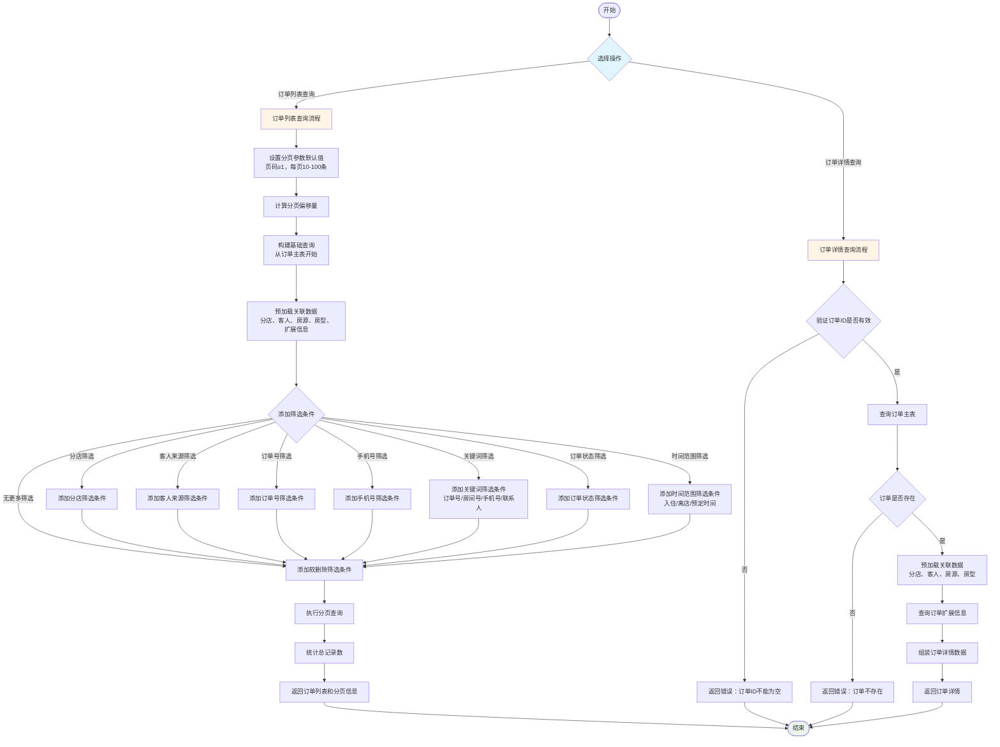

# 订单管理流程图

```mermaid
flowchart TD
    Start([开始]) --> Menu{选择操作}
    
    Menu -->|订单列表查询| List[订单列表查询流程]
    Menu -->|订单详情查询| Detail[订单详情查询流程]
    
    List --> L1[设置分页参数默认值<br/>页码≥1，每页10-100条]
    L1 --> L2[计算分页偏移量]
    L2 --> L3[构建基础查询<br/>从订单主表开始]
    L3 --> L4[预加载关联数据<br/>分店、客人、房源、房型、扩展信息]
    L4 --> L5{添加筛选条件}
    L5 -->|分店筛选| L6[添加分店筛选条件]
    L5 -->|客人来源筛选| L7[添加客人来源筛选条件]
    L5 -->|订单号筛选| L8[添加订单号筛选条件]
    L5 -->|手机号筛选| L9[添加手机号筛选条件]
    L5 -->|关键词筛选| L10[添加关键词筛选条件<br/>订单号/房间号/手机号/联系人]
    L5 -->|订单状态筛选| L11[添加订单状态筛选条件]
    L5 -->|时间范围筛选| L12[添加时间范围筛选条件<br/>入住/离店/预定时间]
    L5 -->|无更多筛选| L13[添加软删除筛选条件]
    L6 --> L13
    L7 --> L13
    L8 --> L13
    L9 --> L13
    L10 --> L13
    L11 --> L13
    L12 --> L13
    L13 --> L14[执行分页查询]
    L14 --> L15[统计总记录数]
    L15 --> L16[返回订单列表和分页信息]
    
    Detail --> D1{验证订单ID是否有效}
    D1 -->|否| D2[返回错误：订单ID不能为空]
    D1 -->|是| D3[查询订单主表]
    D3 --> D4{订单是否存在}
    D4 -->|否| D5[返回错误：订单不存在]
    D4 -->|是| D6[预加载关联数据<br/>分店、客人、房源、房型]
    D6 --> D7[查询订单扩展信息]
    D7 --> D8[组装订单详情数据]
    D8 --> D9[返回订单详情]
    
    L16 --> End([结束])
    D2 --> End
    D5 --> End
    D9 --> End
    
    style Menu fill:#e1f5ff
    style List fill:#fff4e6
    style Detail fill:#fff4e6
    style End fill:#e8f5e9
```
